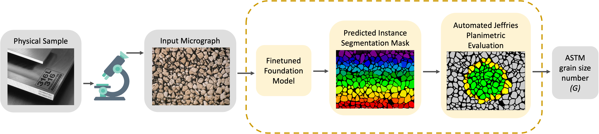
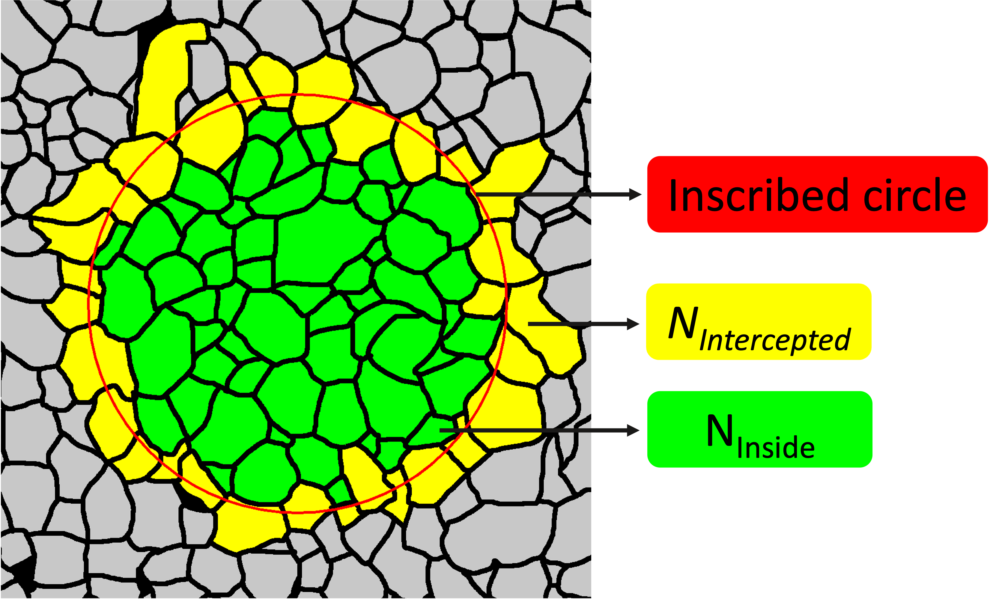
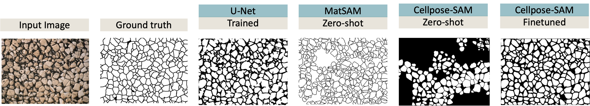

<!-- ## Bridging Foundation Models and ASTM Metallurgical Standards for Automated Grain Size Estimation from Microscopy Images

📍 *Accepted at:*  
**Computer Vision for Multimodal Microscopy Image Analysis Workshop (CVPR 2026)**

---

## 🚧 Code Status

The code for this project is currently being finalized and will be released soon.

🔔 Please check back for updates. -->


# ASTM Grain Size Estimator

[](https://cvmi-workshop.github.io/index.html)
[](https://opensource.org/licenses/MIT)

Official repository for the paper: **"Bridging Foundation Models and ASTM Metallurgical Standards for Automated Grain Size Estimation from Microscopy Images"** accepted at the 11th IEEE Workshop on Computer Vision for Multimodal Microscopy Image Analysis (CVMI), CVPR Workshops 2026.


This repository provides a fully automated pipeline for dense instance segmentation and grain size estimation. It adapts **Cellpose-SAM** to challenging, porous microstructures (such as additively manufactured ExOne Stainless Steel 316L) and integrates its topology-aware gradient tracking with an **ASTM E112 Jeffries planimetric module** to directly predict the ASTM E112-25 Grain Size Number ($G$).


<!--  -->

<p align="center">
  
</p>


## 🔬 How It Works: The Automated Jeffries Planimetric Procedure

Standard foundation models are not designed to output metallurgical metrics. Our pipeline bridges this gap by algorithmically applying the standard Jeffries planimetric method directly to the generated instance masks.

<p align="center">
  
</p>

The algorithm dynamically inscribes an optimal test circle over the prediction mask. To calculate the true grain density ($N_A$) in accordance with ASTM E112-25, the system categorizes the grains:

1. **Internal Grains ($N_{Inside}$):** Grains lying completely inside the test circle are counted as 1 whole unit (shown in green).
2. **Intercepted Grains ($N_{Intercepted}$):** Grains bisected by the circular boundary are counted as 0.5 units (shown in yellow).

### The Dynamic Multiplier

Under standard ASTM E112-25 procedures, the Jeffries multiplier is defined as $f = M^2 / A$, where $M$ is the magnification and $A$ is the test area in mm². 

Because our automated pipeline computes the exact physical area directly from the microstructural pixel scale, the magnification factor is effectively $M=1$. To achieve this, the pipeline relies on a **user-defined spatial calibration factor** (e.g., 2.26 px/μm as determined for our primary dataset) to translate pixel measurements into true physical dimensions. Therefore, the system computes a **dynamic multiplier** that perfectly adapts to the physical area of the specific test circle drawn for each individual image:

$$f_{dynamic} = \frac{1}{A_{circle}}$$

This allows the system to calculate the equivalent whole grains per unit area ($N_A$) with exact spatial calibration regardless of the input image resolution:

$$N_A = f_{dynamic} \left( N_{Inside} + \frac{N_{Intercepted}}{2} \right)$$

Finally, this density directly yields the dimensionless ASTM Grain Size Number ($G$) via the standard logarithmic scaling:

$$G = 3.321928 \log_{10}(N_A) - 2.954$$

---

## 📌 Prerequisites & Dependencies

Our pipeline utilizes a modified Cellpose-SAM architecture and requires several standard Python scientific libraries.

1. **Install the core requirements:**
   ```bash
   pip install -r requirements.txt
   ```

2. **Cellpose-SAM Dependency:** Ensure you have the Cellpose library installed that supports the `"cpsam"` foundation model weights. If you are using a specific fork of Cellpose for SAM integration, clone and install it locally:
   ```bash
   git clone <link-to-your-cellpose-sam-fork>
   cd cellpose
   pip install -e .
   ```

---

## 🚀 Pipeline Overview

The repository is structured into a 4-step modular pipeline to ensure easy replication of our results. Each script is designed to be run sequentially.

### Step 1: Dataset Preparation
This step algorithmically maps and stitches fragmented high-magnification patches into full-field micrographs. It then converts the binary boundary masks into instance-labeled TIFF masks, applying morphological separation to prevent gradient-tracking failure. Finally, it generates CSV files for nested training splits (5%, 10%, 25%, 50%, 75%).

```bash
python 1_prepare_dataset.py \
    --input_patches ./data/raw_patches \
    --input_masks ./data/raw_masks \
    --output_dir ./data/processed
```

### Step 2: Fine-Tuning Cellpose-SAM
Fine-tunes the zero-shot Cellpose-SAM model on the generated splits. Because the smallest splits contain very few images, this script employs an aggressive data augmentation pipeline (geometric distortions, photometric adjustments, and coarse dropout) to ensure robust few-shot scalability and prevent rapid memorization.

```bash
python 2_train.py \
    --data_dir ./data/processed \
    --split split_05_percent \
    --batch_size 2 \
    --epochs 100 \
    --aug_multiplier 30
```

### Step 3: Inference and Segmentation Evaluation
Generates dense segmentation masks for the held-out test set and evaluates standard computer vision metrics. It calculates Average Precision (mAP), Boundary F1 scores, and Grain Count Error for both the zero-shot baseline and your fine-tuned models.

```bash
python 3_inference.py \
    --input_dir ./data/processed/test/images \
    --gt_dir ./data/processed/test/masks \
    --model_path <path-to-fine-tuned-model OR 'cpsam'> \
    --output_dir ./results/inference_output
```

### Step 4: ASTM Jeffries Planimetric Evaluation
Executes the automated Jeffries method to directly calculate the ASTM E112-25 Grain Size Number ($G$). It dynamically calculates the Jeffries multiplier ($f$) based on the physical area of the inscribed test circle.

<!-- This script supports two modes:
* **`superimposed`**: Uses the Ground Truth (GT) mask to determine the optimal circle and copies it to the prediction mask (for strict head-to-head benchmarking).
* **`independent`**: Calculates the optimal circle for GT and Prediction autonomously without any shared geometric information (demonstrating the fully autonomous deployment capability). -->

This script supports two modes:
* **`superimposed`**: Uses the Ground Truth (GT) mask to determine the optimal circle and copies it to the prediction mask (referred to as the **"GT-Derived"** configuration in the paper, used for strict head-to-head benchmarking).
* **`independent`**: Calculates the optimal circle for GT and Prediction autonomously without any shared geometric information (referred to as the **"GT-Free"** configuration in the paper, demonstrating the fully autonomous deployment capability).

```bash
python 4_evaluate_jeffries.py \
    --gt_dir ./data/processed/test/masks \
    --pred_dir ./results/inference_output/binary_masks \
    --output_dir ./results/jeffries_eval \
    --mode independent
```

---
<!-- 
## 📊 Results Summary

Our evaluations demonstrate that utilizing just **5% of the training data (2 samples)**, the fine-tuned Cellpose-SAM pipeline successfully maintains topological separation and predicts the ASTM grain size number ($G$) with a Mean Absolute Percentage Error (MAPE) as low as **1.50%**. Robustness testing across varying target grain counts also empirically validates the ASTM 50-grain sampling minimum. -->


## 📊 Results and Benchmarks

Our evaluations demonstrate that utilizing just **5% of the training data (2 samples)**, the fine-tuned Cellpose-SAM pipeline successfully maintains topological separation. 

### Qualitative Comparison
As shown below, our fine-tuned approach prevents the merging of distinct grains seen in standard U-Net models and entirely avoids the severe over-segmentation caused by MatSAM's adaptive prompting on porous microstructures.


<p align="left">
  
</p>


### Quantitative Performance
For all primary benchmarking evaluations, the automated pipeline was configured to dynamically inscribe a test circle enclosing a target of 60 internal grains (providing a safe 10-grain buffer above the ASTM E112-25 minimum). When evaluated against this standard, the fine-tuned Cellpose-SAM model predicts the final ASTM Grain Size Number (G) with industrial-grade accuracy.

| Model / Split | Grain Density MAPE | ASTM Grain Size (G) MAPE |
| :--- | :--- | :--- |
| U-Net (75% Train) | 26.05% | 6.78% |
| MatSAM (Zero-shot) | 63.81% | 10.61% |
| Cellpose-SAM (Zero-shot) | 38.11% | 3.92% |
| **Cellpose-SAM (5% Train)** | **8.20%** | **1.88%** |

Robustness testing across varying target grain counts also empirically validates the ASTM 50-grain sampling minimum. Furthermore, the pipeline is fully autonomous and does not require any ground-truth geometry to draw the evaluation circle during deployment.

---

## 📝 Citation

If you find this code or our paper useful in your research, please consider citing:

```bibtex
@article{mueez2026bridging,
  title   = {Bridging Foundation Models and ASTM Metallurgical Standards for Automated Grain Size Estimation from Microscopy Images},
  author  = {Mueez, Abdul and Vyas, Shruti},
  journal = {arXiv preprint arXiv:2604.18957},
  year    = {2026},
}
```